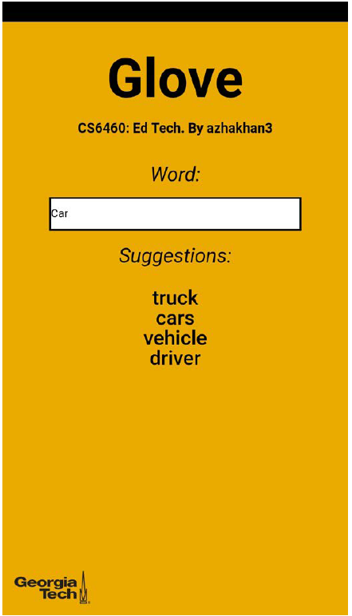

# Word2vec based natural language simplification tool
**CS 6460: Educational Technology 
Georgia Institute of Technologies**

## Abstract
In this paper, a new language simplification (NLS) tool is introduced. At its core is a word2vec algorithm called GloVe, which is used to create vector representations of words and identify similarity distances between them. During the development stage, two most popular natural language simplification methods were explored: lexical simplification and explanation generation. Benefits and challenges of these methods were analyzed. The final tool, however, was built using semantic maps method, which combines features of both lexical simplification and explanation generation.

## Key Components

### Word2Vector representation
Vector representation is a leading technique for measuring syntactic and semantic similarities of words. Each word is represented in a vector form by its distances to other words in multiple dimensions. The algorithm performing vector representation groups conceptually related words such as numbers and weekdays close to each other. These representations find relationships that go beyond syntactic similarities. Using simple algebraic operations on word vectors, deeper understanding of the relationship between words can be extracted (Fuchs, Kaljurand 2008).

### GloVe
GloVe is an unsupervised learning algorithm for obtaining vector representations for words. It considers both global and local context of words for vectorization. It uses co-occurrence matrix to find global context and skip-gram model for local context. It learns vector representations for words so that the dot product for a pair of words is proportional to their co-occurrence count. GloVe model is an open source and collections of pre-trained word vectors are available online (Pennington 2013).
To measure similarity distances between words, k-nearest neighbors algorithm with cosine distance metric was used.

### Text Corpus
To generate vector representations of words a large structured set of texts is required. For this project, only English text was analyzed. Two distinct corpuses were compiled: Common English and Technical English. For Technical English, only computer science related text was considered.

## Development

### Data Gathering

#### Common English
For Common English, the Wikicorpus dataset provided by the Department of Computer Science of the Universitat Politècnica de Catalunya was used. The corpus contained around 600 million words.

#### Technical English
Technical English corpus was created by combining 29,555 research papers from www.arxiv.org repository, 206 computer science related textbooks and 4,232 lecture transcripts from Online Master of Science in Computer Science (OMSCS) program. The final corpus size was 51,249,895 words.

### Data preprocessing
The GloVe algorithm required the text to be in UTF-8 format with no punctuations. To prepare the data, first, non-English words were removed. Next, numbers, punctuations and other non-alphabetical characters were removed. For the final step, ASCII encoded text was converted to UTF-8 format and special characters used for encoding were removed.

### Model training
The original GloVe code published by Stanford University was used to create vector representations of words for both Common English and Technical English. Word similarity distances were measured using KNN algorithm from scikit-learn library. Distance metric parameter of the KNN was set to “cosine”.

For more information, please see <a href="Word2vec based natural language simplification tool - Ayazhan Zhakhan.pdf">Word2vec based natural language simplification tool - Ayazhan Zhakhan</a>

## Application
According to the study by Sökmen, semantic mapping is a powerful technique used to identify, recall and understand the meaning of words (Sökmen 1997). Today, this technique is mainly used in schools to help students with disabilities to enrich their vocabulary. Current ways of creating these maps are brainstorming and manual search for synonyms.
A tool (GloVeNLS) developed for this project performed these tasks automatically. It found both synonyms and conceptually similar words. For example, for a word “Car”, GloVeNLS returned synonym “Vehicle”, a type of car - “Truck” and conceptually similar word “Driver”. Furthermore, semantic mapping aids semantic memorization, which is a form of general knowledge that people accumulate throughout their lives. Semantic form of memory has been proven to be more robust because meanings are linked to ideas and concepts.
Due to the size constraints and slow querying speed of KNN model, online querying proved to be inefficient for a mobile application. Instead, 10,000 most common English words were pre-queried, and results were uploaded to a MySQL database. Next, a web application was developed using HTML, CSS and JavaScript languages. Queries were processed using AJAX in real time. Next, designed web application was converted into a mobile application using PhoneGap development framework (see image 1 for a screenshot).

Online demo of the application is available here: 
http://zhakhan.com/glove/

## Catalog
- Technical – files used to clean and create technical corpus 
- Glove – files used to train the Word2Vec model 
- application files – files used to generate and update database for the application 
- GloveNLS_app – files used to create PhoneGap application 
